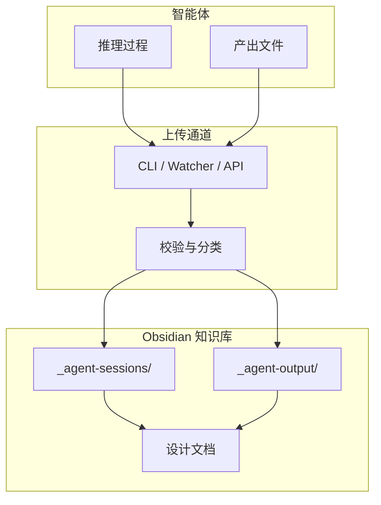

# 🧠 智能体产出知识库

> [!abstract] 欢迎
> 这是一个专为 **本地智能体产出管理** 设计的 Obsidian 知识库。智能体的思考过程、中间产物和最终产出文件都会被自动归档于此，形成可追溯、可检索的知识体系。

---

## 📂 目录结构

```
vault/
├── _agent-output/          # 智能体产出通道
│   ├── inbox/              # 接收区
│   ├── archive/            # 归档区
│   │   ├── reports/        # 报告
│   │   ├── code/           # 代码
│   │   ├── images/         # 图片
│   │   └── data/           # 数据
│   └── schemas/            # 元数据模板
│
├── _agent-sessions/        # 智能体会话（含思考链）
│   ├── 2026-07/            # 按月分桶
│   ├── _templates/         # 笔记模板
│   └── _dashboards/        # 聚合看板
│
├── 本地智能体产出通道设计.md    # 设计方案 ①
├── 智能体思考过程与产出物本地化存储方案.md  # 设计方案 ②
└── README.md               # ← 当前页面
```

---

## 🚀 快速开始

### 1. 用 Obsidian 打开此目录

在 Obsidian 中点击 **"打开本地文件夹"**，选择 `vault/` 目录即可。

### 2. 了解设计方案

| 文档 | 说明 |
|------|------|
| [[本地智能体产出通道设计]] | 产出物上传通道的架构设计（CLI / 监听器 / HTTP API） |
| [[智能体思考过程与产出物本地化存储方案]] | 思考链（Trace）捕获与存储方案 |

### 3. 让智能体开始写入

智能体调用 `trace-session` 工具将推理过程和产出物写入此库：

```bash
# 智能体侧：开始一次会话
trace-session start --session-id "session-20260720-001" --agent "代码助手"

# 智能体侧：记录每步推理
trace-session step --session-id "session-20260720-001" --step 1 --content "分析需求..."

# 智能体侧：产出文件
trace-session output --session-id "session-20260720-001" --file ./output.md

# 智能体侧：结束会话
trace-session finish --session-id "session-20260720-001"
```

---

## 🔗 快速链接

- [[_agent-output/_index|📦 产出通道索引]]
- [[_agent-sessions/_sessions-index|📋 会话索引]]
- [[_agent-sessions/_dashboards/recent-sessions|📊 近期看板]]
- [[_agent-sessions/_templates/session-template|📄 会话模板]]
- [[_agent-sessions/_templates/trace-template|📄 思考链模板]]

---

## 📐 架构一览



---

> [!tip] 提示
> - 所有 `_` 前缀的目录和文件在 Obsidian 文件列表中会置顶显示
> - 使用 `Ctrl+O`（Cmd+O）快速搜索笔记
> - 使用 Graph View 查看笔记之间的关联关系
> - 模板文件位于 `_agent-sessions/_templates/`，新建会话时可直接使用

<!-- 本知识库由智能体自动生成并维护 -->