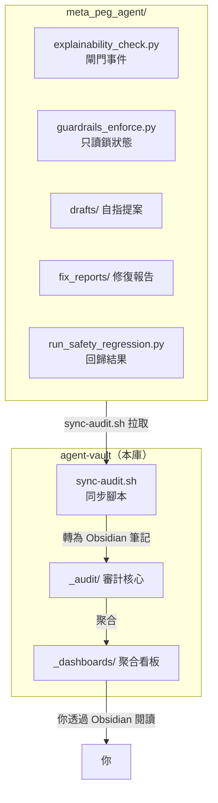

# 可解釋性審計追蹤層

> [!abstract] 定位
> 這是 **Meta-PEG-Agent** 的可解釋性審計追蹤層。
>
> 不是取代 `meta_peg_agent/` 內的既有機制，而是在其之上提供**一層可視化的歷史軌跡**——把閘門事件、自指提案、修復記錄、安全回歸結果聚合到 Obsidian 中，讓系統的「當下安全」延伸為「事後可追溯、可分析、可解釋」。

---

## 與 meta-peg-agent 的關係



> [!tip] 關鍵原則
> 本 vault **唯讀**——只從 `meta_peg_agent/` 拉取數據，從不反向寫入。所有原始數據的權威來源仍是 `meta_peg_agent/` 工程本身。

---

## 目錄結構

```
vault/
├── README.md                    ← 你正在看的歡迎頁
├── 審計追蹤層架構設計.md          ← 本 vault 的設計文件
├── _audit/                      ← 審計核心（自動填充）
│   ├── _gate-events/            ← 閘門事件（從 logs/ 同步）
│   │   ├── 2026-07/
│   │   │   ├── gate-20260714-125558-PASS-20bceea9.md
│   │   │   ├── gate-20260714-125600-REJECT-4f81d002.md
│   │   │   └── gate-20260714-130852-REJECT-5d7cdda0.md
│   │   └── _index.md            ← 閘門事件索引
│   ├── _proposals/              ← 自指改寫提案（從 drafts/ 同步）
│   │   ├── PEG-2026-07-13-001.md
│   │   ├── self-modify-001.md
│   │   └── _index.md            ← 提案索引
│   ├── _fix-reports/            ← 修復報告（從 fix_reports/ 同步）
│   │   ├── FIX-002-guardrails-readonly-windows.md
│   │   └── _index.md            ← 修復報告索引
│   └── _dashboards/             ← 聚合看板（自動生成）
│       ├── gate-trends.md       ← 閘門趨勢：通過/拒絕率
│       └── safety-posture.md    ← 安全態勢總覽
├── _design/                     ← 設計文檔
│   └── 審計追蹤層架構設計.md
└── _scripts/                    ← 同步腳本
    └── sync-audit.sh            ← 從 meta_peg_agent/ 拉取數據
```

---

## 快速開始

### 前置條件

- 你已經在 Obsidian 中打開了本 vault
- `meta_peg_agent/` 在你的 Windows 上可訪問

### 首次同步

在 PowerShell 中執行：

```powershell
cd C:\Users\1\Documents\agent-vault
bash _scripts/sync-audit.sh -s C:\Users\1\WorkBuddy\2026-07-13-11-57-54\meta_peg_agent
```

完成後回到 Obsidian，刷新檔案列表即可看到審計內容。

### 日常使用

每次 `meta_peg_agent/` 有新事件（閘門觸發、提案通過、回歸完成），執行一次同步即可在 Obsidian 中看到更新。

---

## 快速連結

- [[_audit/_gate-events/_index|📋 閘門事件索引]]
- [[_audit/_proposals/_index|📋 自指提案索引]]
- [[_audit/_fix-reports/_index|📋 修復報告索引]]
- [[_audit/_dashboards/gate-trends|📊 閘門趨勢看板]]
- [[_audit/_dashboards/safety-posture|📊 安全態勢看板]]
- [[審計追蹤層架構設計|📐 設計文件]]

---

## 設計原則

1. **不可篡改**：原始數據的權威來源是 `meta_peg_agent/`，本 vault 只做聚合展示
2. **可追溯**：每個事件都可追溯到原始 JSONL 記錄和源代碼位置
3. **可分析**：看板自動計算通過率、趨勢、異常模式
4. **零侵入**：不需要修改 `meta_peg_agent/` 的任何代碼

<!-- 本 vault 由 TRAE Agent 設計，對齊 meta-peg-agent 工程架構 -->