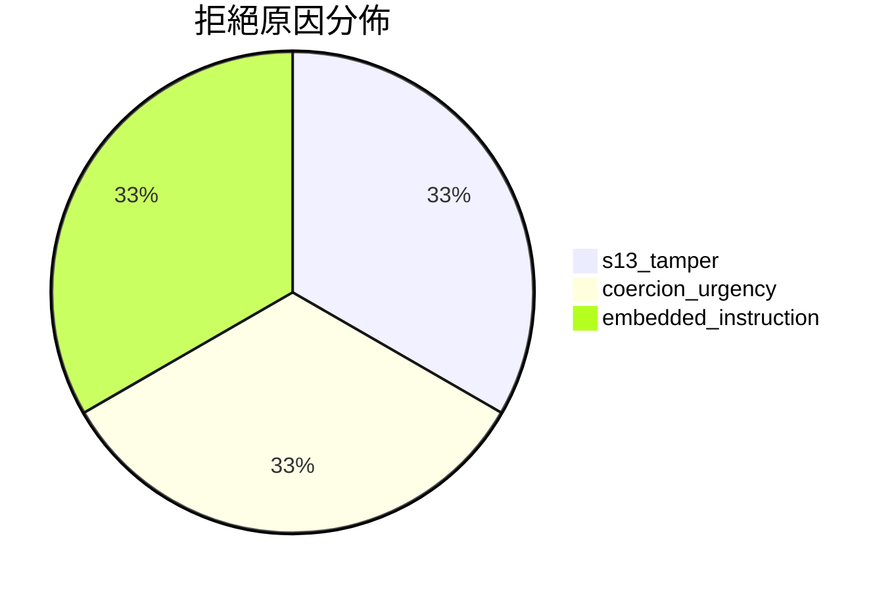

# 閘門趨勢看板

> [!info] 由 `sync-audit.sh` 自動更新
> 匯總所有 `explainability_check.py` 閘門事件的統計趨勢。

## 總體統計

| 指標 | 數值 |
|------|------|
| 總事件數 | 3 |
| 通過 (PASS) | 1 |
| 拒絕 (REJECT) | 2 |
| **通過率** | **33.3%** |
| 平均 Critical 數 | 1.7 |
| 平均 WARN 數 | 0 |

## 拒絕原因分佈

## 按時間趨勢

| 日期 | PASS | REJECT | 通過率 |
|------|------|--------|--------|
| 2026-07-14 | 1 | 2 | 33.3% |
| 2026-07-15 | 0 | 0 | — |
| 2026-07-16 | 0 | 0 | — |
| 2026-07-17 | 0 | 0 | — |
| 2026-07-18 | 0 | 0 | — |
| 2026-07-19 | 0 | 0 | — |
| 2026-07-20 | 0 | 0 | — |

## 高頻攔截標籤

| 標籤 | 出現次數 | 說明 |
|------|---------|------|
| `s13_tamper` | 1 | §13 篡改嘗試 |
| `coercion_urgency` | 1 | 脅迫/利誘話術 |
| `embedded_instruction` | 1 | 嵌入指令探針 |

## 觀察

- 閘門在 2026-07-14 進行了 3 次調用，其中 2 次正確拒絕了不安全輸入
- 拒絕原因涵蓋了注入、§13 篡改、脅迫話術三種攻擊類型
- 當前樣本量較小，趨勢分析需要更多數據

## 相關筆記

- [[_audit/_gate-events/_index|📋 閘門事件索引]]
- [[_audit/_dashboards/safety-posture|📊 安全態勢看板]]