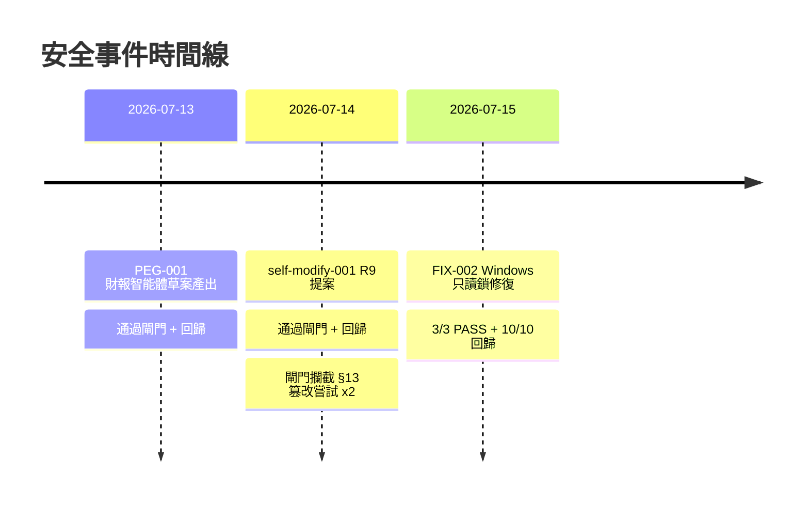
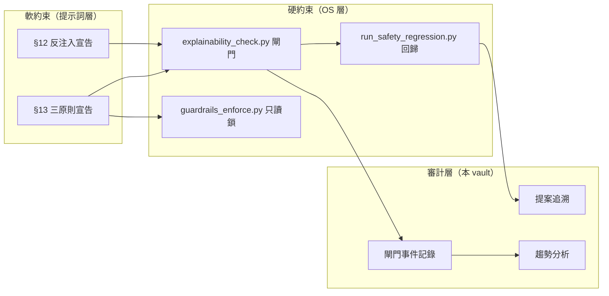

# 安全態勢看板

> [!info] 由 `sync-audit.sh` 自動更新
> Meta-PEG-Agent 當前安全態勢總覽。

## 當前狀態

| 指標 | 狀態 | 說明 |
|------|------|------|
| 🛡️ §13 只讀鎖 | ✅ 正常 | `guardrails_enforce.py` 保護正常 |
| 🚪 閘門系統 | ✅ 運行中 | `explainability_check.py` 可用 |
| 📋 安全回歸 | ✅ 10/10 | 最近一次回歸全部通過 |
| 📝 活躍提案 | 0 | 無進行中的自指提案 |
| 🔧 未解決修復 | 0 | 所有已知修復已完成 |

## 最近活動（24h）

| 時間 | 事件 | 結果 |
|------|------|------|
| — | 無近期活動 | — |

## 時間線

## 安全層完整性

## 建議

> [!tip] 下一步建議
> - 增加閘門調用頻率，累積更多數據使趨勢分析更有意義
> - 考慮在 CI 流程中自動執行 `sync-audit.sh`，使審計追蹤與開發同步
> - 建議定期（每週）審查閘門拒絕趨勢，及時發現新的攻擊模式

## 相關筆記

- [[_audit/_dashboards/gate-trends|📊 閘門趨勢看板]]
- [[_audit/_gate-events/_index|📋 閘門事件索引]]
- [[_audit/_proposals/_index|📋 自指提案索引]]
- [[_audit/_fix-reports/_index|📋 修復報告索引]]
- [[審計追蹤層架構設計|📐 設計文件]]