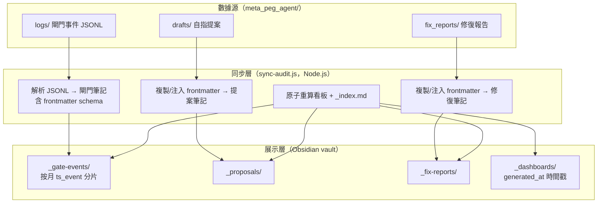
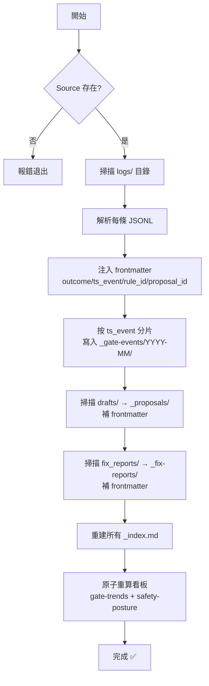

# 審計追蹤層架構設計

> [!abstract] 定位
> 本文件定義 `agent-vault` 作為 Meta-PEG-Agent 可解釋性審計追蹤層的完整架構——包括數據源、數據契約、同步機制、筆記格式、看板聚合規則。
>
> 本設計已通過 ArchQ 架構治理評審，以下為 v2.0 改進後的設計規格。
>
> > [!warning] 當前狀態
> > `_audit/` 目錄結構已就緒，但尚未填入實際數據。需在 Windows 本機手動執行 `sync-audit.js` 完成首次同步後，閘門事件、提案、修復報告及看板才會寫入。

---

## 一、架構概覽



---

## 二、數據契約（frontmatter schema）

> [!warning] 強制數據契約（P0-1）
> 所有同步進入 `_audit/` 的 `.md` 檔案必須包含 YAML frontmatter。
> 缺少必要欄位的檔案，看板聚合將無法正確計算。

### 2.1 閘門事件 schema

```yaml
---
title: 閘門事件: REJECT · s13_tamper     # 可讀標題
gate_id: gate-a1b2c3d4                     # 內容尋址 ID（SHA256 前 8 碼）
outcome: PASS | REJECT                     # P0: 判決結果
ts_event: 2026-07-14T05:08:52+00:00        # P0: 事件發生時間（分片鍵）
ts_sync: 2026-07-21T10:00:00+00:00         # P0: 同步時間
rule_id: s13_tamper,coercion_urgency       # P0: 觸發規則（逗號分隔）
actor: agent | human                       # P0: 執行者
proposal_id: PEG-2026-07-13-001            # P1: 關聯提案（雙向鏈結）
source_hash: 4f81d002                      # P0: 來源內容哈希
schema_version: "1.0"                      # 數據契約版本
tags:                                      # Obsidian 標籤
  - gate-event
  - reject
  - s13_tamper
critical_count: 3                          # 嚴重攔截數
warn_count: 0                              # 警告數
total_alerts: 3                            # 總攔截數
source: --text (stdin)                     # 來源
source_file: logs/gate_20260714_125600...  # 來源檔案路徑
---
```

### 2.2 提案 schema

```yaml
---
title: "提案: Self-Modify #001"
proposal_id: self-modify-001
gate_event_id: gate-a1b2c3d4               # P1: 關聯閘門事件（雙向鏈結）
status: proposed | adopted | rejected       # 提案狀態
ts_event: 2026-07-13T14:00:00+00:00        # 提案時間
ts_sync: 2026-07-21T10:00:00+00:00         # 同步時間
schema_version: "1.0"
tags:
  - proposal
---
```

### 2.3 修復報告 schema

```yaml
---
title: "修復報告: FIX-002"
fix_id: FIX-002
gate_event_id: gate-a1b2c3d4               # P1: 關聯閘門事件
status: open | resolved | closed            # 修復狀態
ts_event: 2026-07-13T14:00:00+00:00        # 報告時間
ts_sync: 2026-07-21T10:00:00+00:00         # 同步時間
schema_version: "1.0"
tags:
  - fix-report
---
```

---

## 三、數據流向與治理規則

### 3.1 單向同步（logs → _audit）

> [!important] 源真相源策略（P0-2）
> `_audit/` 是**唯讀鏡像**，不是可編輯副本。
> 所有修正必須回源（logs/、drafts/、fix_reports/）修改，再重跑同步。
> 同步腳本對 `_audit/` 已有檔案預設「跳過不覆蓋」，除非源檔案顯式更新。

**同步方向：** 單向（logs → _audit），永不反向。

### 3.2 分片鍵：按 ts_event 月份

> [!warning] 分片鍵修正（P0-3）
> 閘門事件按月分片，**分片鍵為 `ts_event`（事件發生時間）**，而非同步時間。
> 例如 6 月的事件即使 7 月同步，仍寫入 `2026-06/` 目錄。

目錄結構：
```
_audit/_gate-events/
├── 2026-06/          ← 6 月的事件
│   ├── gate-PASS-xxxx.md
│   └── gate-REJECT-xxxx.md
├── 2026-07/          ← 7 月的事件
│   ├── gate-PASS-yyyy.md
│   └── gate-REJECT-yyyy.md
└── _index.md
```

### 3.3 冪等性

- 閘門事件以 `{outcome}-{source_hash前8碼}` 去重，已存在的跳過
- 提案和修復報告以檔名去重
- 看板每次完全重新生成，標 `generated_at` 時間戳
- 支援 `--dry-run` 參數，只打印操作不落盤

### 3.4 保留與歸檔

> `--retain-months 13`（預設）：超過 13 個月的 `ts_event` 自動標記為「已歸檔」，不寫入看板，但保留在 `_audit/` 中。

### 3.5 Tombstone 策略（P1-3）

> [!important] 追加只讀 + 顯式 tombstone
> 審計記錄**只增不刪**。若一筆記錄在源中被刪除，`_audit/` 中的對應檔案**不受影響**（保留歷史記錄）。
> 如需標記為已廢棄，請在源檔案中添加 `tombstone: true` 並重同步，腳本會更新 `_index.md` 中的狀態。
> 同步腳本永不自動刪除 `_audit/` 中的任何檔案。

---

## 四、同步腳本設計

### 4.1 CLI 用法

```bash
# 完整同步
node _scripts/sync-audit.js -Source C:\Users\1\Documents\meta_peg_agent

# 指定 vault 目錄（預設為腳本所在的上層目錄）
node _scripts/sync-audit.js -Source ../meta-peg-agent -Dest ../vault

# 乾淨執行（不落盤，預覽操作）
node _scripts/sync-audit.js -Source ../meta-peg-agent --dry-run

# 自訂保留期（6 個月）
node _scripts/sync-audit.js -Source ../meta-peg-agent --retain-months 6
```

### 4.2 同步流程



### 4.3 冪等實現

- 閘門事件：`fs.existsSync(outPath)` 檢查，已存在則跳過
- 提案/修復：同檔名檢查，已存在則跳過
- `_index.md`：每次完全重新生成（掃描實際文件列表）
- 看板：每次完全重新計算

### 4.4 唯讀保障

每筆閘門事件筆記正文底部包含：

```
> [!warning] 唯讀鏡像
> 本檔案為 `logs/gate_xxx.jsonl` 的同步拷貝。
> **修正方式**：回源 `meta_peg_agent/logs/` 修改，再重跑同步。
> 直接編輯本檔案將被同步腳本跳過（不覆蓋），但違反審計一致性。
```

### 4.5 觸發方式（手動 CLI）

> [!important] 同步非自動化守護程序
> 同步為**手動觸發**，由 WorkBuddy 在 Windows 本機執行 CLI 命令完成。
> 無駐留監聽器、無定時任務、無 Git hook。

**完整觸發鏈：**

```
TRAE 沙箱修改 sync-audit.js
  → git push（trae-delivery 分支，HTTPS + fine-grained PAT）
  → WorkBuddy 本機 git pull（SSH）
  → 外科手術式搬運至 vault 工作樹
  → 手動執行 node _scripts/sync-audit.js -Source <meta_peg_agent_path>
  → git add/commit/push master
```

**典型執行頻率：** 隨 meta-peg-agent 的閘門事件、提案或修復報告有新增時，按需觸發。無固定排程。

---

## 五、看板指標定義

### 5.1 閘門趨勢（gate-trends.md）

| 指標 | 計算方式 | 說明 |
|------|---------|------|
| 事件總數 | COUNT(gate-events) | 閘門總調用次數 |
| 通過率 | PASS / TOTAL | 安全閘門通過比例 |
| 拒絕率 | REJECT / TOTAL | 被攔截的比例 |
| 按月分佈 | 各月份 PASS / REJECT | 時間趨勢 |
| 攔截規則分佈 | 各規則 PASS / REJECT | 高頻攔截類型 |

**frontmatter 時間戳：**
```yaml
---
generated_at: 2026-07-21T10:00:00+00:00
total_events: 42
pass_rate: 85.7%
schema_version: "1.0"
---
```

### 5.2 安全態勢（safety-posture.md）

| 指標 | 計算方式 |
|------|---------|
| 閘口事件總數 | COUNT(gate-events) |
| 通過率 | PASS / TOTAL |
| 待審/在冊提案 | COUNT(_proposals/*.md) |
| 修復報告 | COUNT(_fix-reports/*.md) |
| 最近 5 筆 REJECT | 從 events 取最後 5 筆 REJECT |
| 最近同步時間 | `generated_at` |

---

## 六、ArchQ 改進對照表

| 問題 | 等級 | 狀態 | 實作位置 |
|------|------|------|---------|
| P0-1 強制數據契約 | 🔴 P0 | ✅ 已修復 | `sync-audit.js` frontmatter 生成 + schema 定義 |
| P0-2 唯讀鏡像策略 | 🔴 P0 | ✅ 已修復 | 冪等跳過 + 正文唯讀警告 + _index.md 宣告 |
| P0-3 分片鍵（ts_event） | 🔴 P0 | ✅ 已修復 | `monthKey(tsEvent)` 取代同步時間 |
| P1-1 雙向 ID | 🟡 P1 | ✅ 已修復 | 閘門含 `proposal_id`，提案/修復含 `gate_event_id` |
| P1-2 看板原子重算 | 🟡 P1 | ✅ 已修復 | 同步末尾自動重算 + `generated_at` 時間戳 |
| P1-3 Tombstone 策略 | 🟡 P1 | ✅ 已修復 | _index.md 明文宣告「只增不刪」 |
| P2-1 Node.js UTF-8 | 🟢 P2 | ✅ 已修復 | 原生 Node.js，跨平台統一編碼 |
| P2-2 保留期 | 🟢 P2 | ✅ 已修復 | `--retain-months 13` 預設 |
| P2-3 --dry-run | 🟢 P2 | ✅ 已修復 | `--dry-run / -n` 參數 |

---

## 七、與 meta-peg-agent 的安全關係

> [!important] 信任邊界
> 本 vault 是 **展示層**，不是安全邊界的一部分。
>
> - 安全決策仍由 `explainability_check.py`（閘門）和 `guardrails_enforce.py`（只讀鎖）在 `meta_peg_agent/` 中執行
> - 本 vault 僅將這些決策的記錄可視化，便於審計和追溯
> - 即使 vault 被篡改，不影響 `meta_peg_agent/` 的安全防護

---

## 八、使用場景

### 場景一：事後審計

> 某次 PEG-A 自指改寫後，你想確認是否所有步驟都過了閘門。

1. 打開 [[_audit/_proposals/_index]]，找到該提案
2. 從提案筆記的 frontmatter 查看 `gate_event_id`
3. 點擊關聯的閘門事件 ID，查看攔截詳情

### 場景二：安全趨勢分析

> 你想了解近期閘門拒絕率是否上升。

1. 打開 [[_audit/_dashboards/gate-trends]]
2. 查看「按月分佈」表格和「攔截分佈」
3. 若發現異常，點擊對應月份查看具體事件

### 場景三：修復追溯

> 你記得之前修過一個 Windows 只讀鎖的問題，想確認當前狀態。

1. 打開 [[_audit/_fix-reports/_index]]
2. 找到 `FIX-002` 修復報告
3. 查看根因分析和驗證結果

---

## 相關筆記

- [[README]] — 歡迎頁與快速開始
- [[審計追蹤層設計評審_ArchQ]] — ArchQ 架構治理評審全文
- [[_audit/_gate-events/_index]] — 閘門事件索引
- [[_audit/_proposals/_index]] — 自指提案索引
- [[_audit/_fix-reports/_index]] — 修復報告索引
- [[_audit/_dashboards/gate-trends]] — 閘門趨勢看板
- [[_audit/_dashboards/safety-posture]] — 安全態勢看板

---

%% 變更記錄 %%

**變更記錄**
- 2026-07-21：v2.1 同步觸發方式更正——從「自動化落地」改為「手動 CLI 按需觸發」，新增 §4.5 完整觸發鏈，摘要標註當前狀態（`_audit/` 待首次同步）
- 2026-07-21：v2.0 重大更新——補全強制數據契約、唯讀鏡像策略、ts_event 分片、雙向 ID、看板原子重算、Tombstone 策略、Node.js 腳本、保留期、--dry-run
- 2026-07-20：v1.0 初始版本，定義審計追蹤層架構