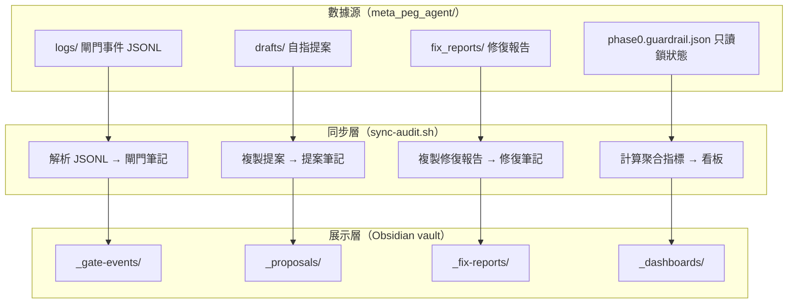
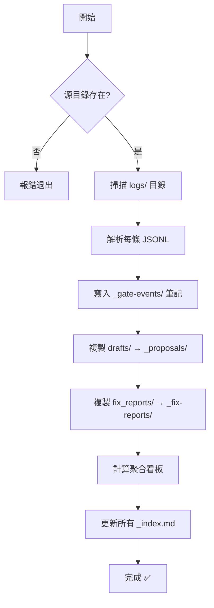

# 審計追蹤層架構設計

> [!abstract] 定位
> 本文件定義 `agent-vault` 作為 Meta-PEG-Agent 可解釋性審計追蹤層的完整架構——包括數據源、同步機制、筆記格式、看板聚合規則。

---

## 一、架構概覽



---

## 二、數據源與筆記格式

### 2.1 閘門事件（從 `logs/` 同步）

**來源**：`meta_peg_agent/logs/gate_{timestamp}_{seq}_{VERDICT}_{hash}.jsonl`

**每條 JSONL 包含**：
- `timestamp`、`verdict`（PASS/REJECT）、`source`
- `input_hash`、`input_length`、`input_preview`
- `summary`：`{ total_alerts, critical, warn }`
- `interceptions`：攔截詳情（severity、tag、reason、snippet）

**生成的 Obsidian 筆記格式**：

```yaml
---
title: "閘門事件: REJECT · s13_tamper"
gate_id: gate-20260714-125600-08
timestamp: 2026-07-14T05:08:52+00:00
verdict: REJECT
tags:
  - gate-event
  - REJECT
  - s13_tamper
critical_count: 3
input_hash: 4f81d002a00e1274
input_preview: "PEG-A 自指改进提案 diff #002..."
source: "--text (stdin)"
---
```

### 2.2 自指提案（從 `drafts/` 同步）

**來源**：`meta_peg_agent/drafts/PEG-*.md`、`self_modify_*.diff.md`

**關鍵元數據**：
- 提案 ID、版本、狀態（proposed / adopted / rejected）
- 擬改區塊、diff 內容
- self_test 期望與驗證結果
- 回滾方式

### 2.3 修復報告（從 `fix_reports/` 同步）

**來源**：`meta_peg_agent/fix_reports/FIX-*.md`

**關鍵元數據**：
- 報告編號、日期、修復人、嚴重級別
- 問題描述、根因分析、修復方案
- 驗證結果（場景測試、回歸測試）

### 2.4 聚合看板（自動計算）

**閘門趨勢**：按時間維度計算通過率

**安全態勢**：當前狀態快照

---

## 三、同步腳本設計

### 3.1 CLI 用法

```bash
# 完整同步
bash _scripts/sync-audit.sh -s /path/to/meta_peg_agent

# 僅同步閘門事件
bash _scripts/sync-audit.sh -s /path/to/meta_peg_agent --only-gates

# 僅同步提案
bash _scripts/sync-audit.sh -s /path/to/meta_peg_agent --only-proposals

# 僅更新看板
bash _scripts/sync-audit.sh -s /path/to/meta_peg_agent --only-dashboards
```

### 3.2 同步流程



### 3.3 冪等性

- 閘門事件以 `gate_id` 去重，已存在的跳過
- 提案和修復報告以檔名去重
- 看板每次完全重新生成

---

## 四、看板指標定義

### 4.1 閘門趨勢（gate-trends.md）

| 指標 | 計算方式 | 說明 |
|------|---------|------|
| 總事件數 | COUNT(gate-events) | 閘門總調用次數 |
| 通過率 | PASS / TOTAL | 安全閘門通過比例 |
| 拒絕率 | REJECT / TOTAL | 被攔截的比例 |
| 平均 Critical 數 | AVG(critical_count) | 每次攔截的平均嚴重度 |
| 高頻攔截標籤 | TOP 5 tag | 最常觸發的攔截類型 |

### 4.2 安全態勢（safety-posture.md）

| 指標 | 說明 |
|------|------|
| 當前只讀鎖狀態 | guardrails_enforce.py 保護的文件是否正常 |
| 最近 24h 事件數 | 短期活動量 |
| 活躍提案數 | 正在進行的自指改寫 |
| 未解決修復項 | 進行中的修復報告 |
| 安全回歸狀態 | 最近一次回歸是否 10/10 |

---

## 五、與 meta-peg-agent 的安全關係

> [!important] 信任邊界
> 本 vault 是 **展示層**，不是安全邊界的一部分。
>
> - 安全決策仍由 `explainability_check.py`（閘門）和 `guardrails_enforce.py`（只讀鎖）在 `meta_peg_agent/` 中執行
> - 本 vault 僅將這些決策的記錄可視化，便於審計和追溯
> - 即使 vault 被篡改，不影響 `meta_peg_agent/` 的安全防護

---

## 六、使用場景

### 場景一：事後審計

> 某次 PEG-A 自指改寫後，你想確認是否所有步驟都過了閘門。

1. 打開 [[_audit/_proposals/_index]]，找到該提案
2. 從提案筆記的 `verification` 區塊查看閘門結果和回歸結果
3. 點擊關聯的閘門事件 ID，查看攔截詳情

### 場景二：安全趨勢分析

> 你想了解近期閘門拒絕率是否上升。

1. 打開 [[_audit/_dashboards/gate-trends]]
2. 查看通過率趨勢圖和拒絕原因分佈
3. 若發現異常，點擊對應時間段查看具體事件

### 場景三：修復追溯

> 你記得之前修過一個 Windows 只讀鎖的問題，想確認當前狀態。

1. 打開 [[_audit/_fix-reports/_index]]
2. 找到 `FIX-002` 修復報告
3. 查看根因分析和驗證結果

---

## 相關筆記

- [[README]] — 歡迎頁與快速開始
- [[_audit/_gate-events/_index]] — 閘門事件索引
- [[_audit/_proposals/_index]] — 自指提案索引
- [[_audit/_fix-reports/_index]] — 修復報告索引
- [[_audit/_dashboards/gate-trends]] — 閘門趨勢看板
- [[_audit/_dashboards/safety-posture]] — 安全態勢看板

---

%% 變更記錄 %%

**變更記錄**
- 2026-07-20：v1.0 初始版本，定義審計追蹤層架構