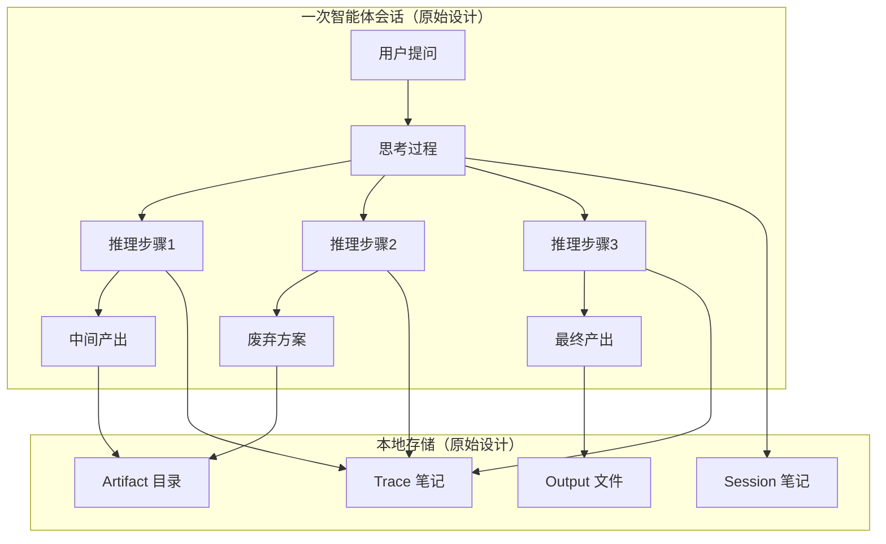
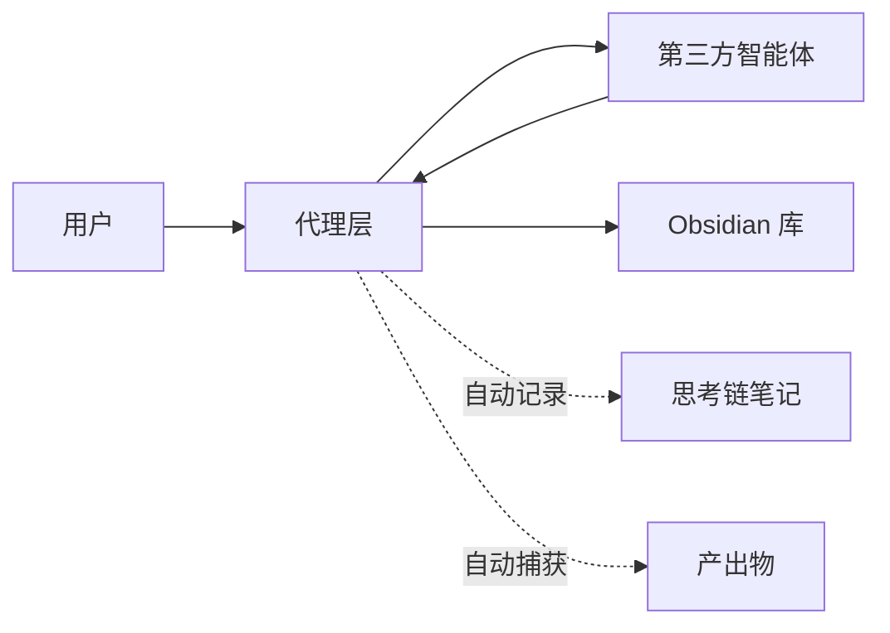

# 智能体思考过程与产出物本地化存储方案

> [!important] 设计演进说明
> 本文档记录的是**思考链捕获方向的早期设计探索**（v1.0，2026-07-20），其核心概念——会话组织、双向追溯、废弃方案沉淀——在后续架构演进中被吸收进审计追踪层。
>
> **当前实际落地架构**请参见 [[審計追蹤層架構設計]]（v2.0，已通过 ArchQ 评审）。
>
> 本文档保留为设计历史记录，不作为当前实现依据。

---

## 设计演进脉络

```
v1.0  通用智能体产出通道（agent-upload/inbox 模式）
  └── 本地智能体产出通道设计.md
       └── v1.1 信任边界版（附录重写，对齐 vault_bridge.py）

v1.0  通用智能体思考链捕获（_agent-sessions/ 会话模式）
  └── 本文档（智能体思考过程与产出物本地化存储方案.md）
       └── v2.0 设计历史归档 ← 当前版本

v2.0  Meta-PEG-Agent 可解释性审计追踪层（_audit/ 只读镜像）
       └── 審計追蹤層架構設計.md（实际落地架构）
```

> 从「通用智能体产出通道」到「审计追踪层」的演进，是在发现 `meta_peg_agent` 项目后做出的关键设计决策——从通用方案收敛为专用审计层，与现有安全架构深度对齐。

---

## 核心概念（设计历史）

以下是 v1.0 原始设计的核心概念，虽被后续架构取代，但其设计思路仍有参考价值。

### 会话组织



### 双向追溯

每个产出物通过元数据链接回产生它的思考步骤——这是被审计追踪层继承的关键设计理念。

### 废弃方案沉淀

记录被否决的方案及其原因，避免重复踩坑——同样被审计追踪层的 `tombstone` 策略继承。

---

## 存储结构（原始设计）

```
📁 _agent-sessions/                  # 智能体会话根目录（原始设计）
├── 📁 2026-07/                      # 按月分桶
│   ├── 📁 session-20260720-001/     # 单次会话文件夹
│   │   ├── 📄 session.md            # 会话概览笔记
│   │   ├── 📄 trace.md              # 完整思考链笔记
│   │   ├── 📁 outputs/              # 产出物目录
│   │   └── 📁 artifacts/            # 中间产物
│   └── 📁 session-20260720-002/
├── 📁 _templates/                   # 模板文件
├── 📁 _dashboards/                  # 聚合看板
└── 📄 _sessions-index.md            # 全局会话索引
```

> 当前实际采用 `_audit/` 结构，按 `ts_event` 月份分片，详见 [[審計追蹤層架構設計#3.2 分片鍵：按 ts_event 月份]]。

---

## 三种捕获模式（原始设计）

### 模式一：智能体自埋点（推荐）

智能体在推理过程中主动调用记录接口：

```bash
# 创建会话
trace-session start \
  --session-id "session-20260720-001" \
  --agent "代码助手" \
  --intent "重构用户认证模块"

# 记录每一步思考
trace-session step \
  --session-id "session-20260720-001" \
  --step 1 \
  --content "分析现有 Session 架构..." \
  --type analysis

# 记录废弃方案
trace-session abandon \
  --session-id "session-20260720-001" \
  --plan "OAuth2 方案" \
  --reason "过度设计，仅内部服务无需授权服务器"

# 记录最终产出
trace-session output \
  --session-id "session-20260720-001" \
  --file ./outputs/jwt-auth.py \
  --type code \
  --step 4

# 结束会话
trace-session finish --session-id "session-20260720-001"
```

### 模式二：日志后处理

智能体输出结构化日志，事后由解析器处理：

```json
// agent-trace.jsonl — 每行一个 JSON 事件
{"event": "step", "session": "s001", "seq": 1, "type": "analysis", "content": "分析需求..."}
{"event": "step", "session": "s001", "seq": 2, "type": "explore", "content": "考虑方案A...", "abandoned": true}
{"event": "step", "session": "s001", "seq": 3, "type": "decision", "content": "选择方案B"}
{"event": "output", "session": "s001", "file": "jwt-auth.py", "type": "code"}
{"event": "end", "session": "s001", "total_steps": 12}
```

```bash
# 解析日志并生成 Obsidian 笔记
trace-parse agent-trace.jsonl --vault /path/to/obsidian-vault
```

### 模式三：代理模式（零侵入）

适用于无法修改的第三方智能体，通过代理层捕获所有交互：



> 当前实际采用 `sync-audit.js` 单向同步，从 `meta_peg_agent/logs/`（JSONL 闸门事件）→ `_audit/` 只读镜像，详见 [[審計追蹤層架構設計#四、同步腳本設計]]。

---

## 被继承的设计元素

下表列出原始设计中被审计追踪层继承的概念：

| 原始设计概念 | 审计追踪层对应 | 说明 |
|-------------|---------------|------|
| 会话（Session）组织 | 按 `ts_event` 月份分片 | 分片键从同步时间改为事件时间 |
| 双向追溯 | `proposal_id` ↔ `gate_event_id` | 闸门事件与提案/修复报告互链 |
| 废弃方案沉淀 | Tombstone 策略 | 只增不删，显式标记废弃 |
| 聚合看板 | `_dashboards/gate-trends` + `safety-posture` | 原子重算，标 `generated_at` |
| 元数据契约 | frontmatter schema | 强制数据契约（P0-1） |
| JSONL 日志后处理 | `sync-audit.js` 解析 JSONL → `.md` | 日志后处理模式被实际采用 |

---

## 相关笔记

- [[本地智能体产出通道设计]] — 前置设计文档（v1.1 信任边界版）
- [[審計追蹤層架構設計]] — 当前实际落地架构（v2.0）
- [[審計追蹤層設計評審_ArchQ]] — ArchQ 架构治理评审全文
- [[_audit/_gate-events/_index]] — 闸门事件索引（实际实现）
- [[_audit/_dashboards/gate-trends]] — 闸门趋势看板（实际实现）

---

%% 变更记录 %%

**变更记录**
- 2026-07-21：v2.0 重大更新——重新定位为设计历史记录，对齐审计追踪层架构，标注被继承的设计元素
- 2026-07-20：v1.0 初始版本，定义思考链捕获方案与三种捕获模式