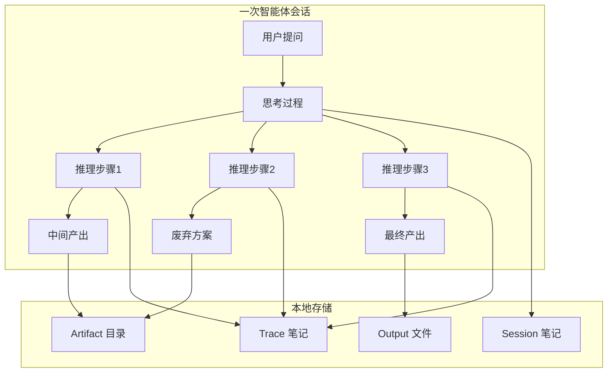
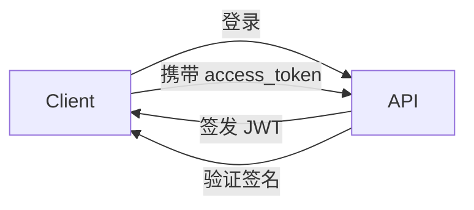
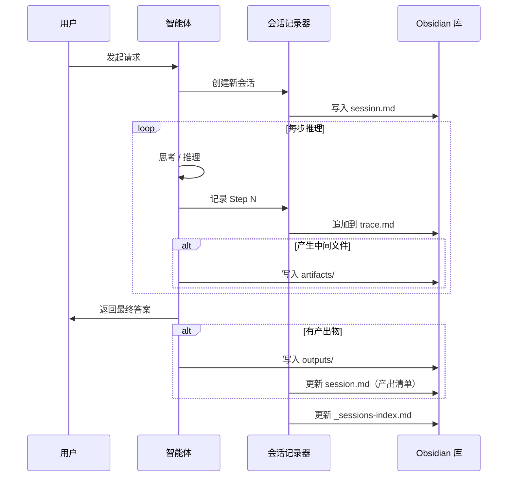
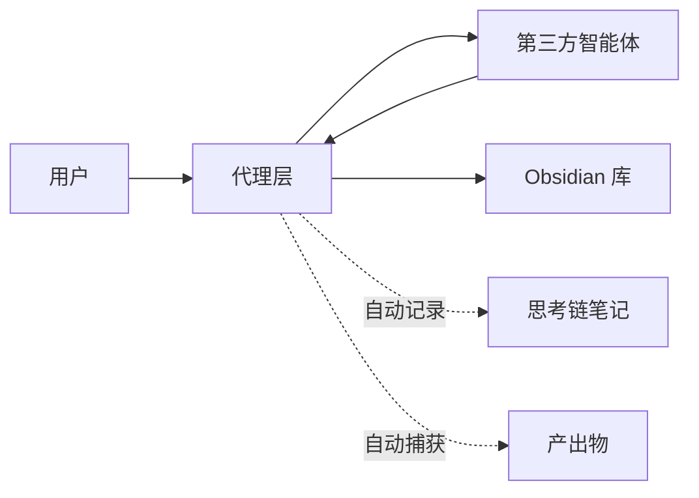

# 智能体思考过程与产出物本地化存储方案

> [!abstract] 设计目标
> 在 [[本地智能体产出通道设计]] 的基础上，**进一步将智能体的完整思考过程（推理链路、中间决策、探索分支、废弃方案）一并本地化存储**，实现"思考痕迹 + 最终产出"的完整可追溯。每个结论都能追溯到产生它的推理步骤，每个废弃方案都不会丢失。

---

## 核心概念



整个方案围绕 **会话（Session）** 组织：一次用户请求对应一次会话，会话内包含多个**思考步骤（Trace Step）** 和最终**产出物（Output）**，全部持久化到 Obsidian 知识库中。

---

## 存储结构

```
📁 _agent-sessions/                  # 智能体会话根目录
├── 📁 2026-07/                      # 按月分桶
│   ├── 📁 session-20260720-001/     # 单次会话文件夹
│   │   ├── 📄 session.md            # 会话概览笔记
│   │   ├── 📄 trace.md              # 完整思考链笔记
│   │   ├── 📁 outputs/              # 产出物目录
│   │   │   ├── 📄 final-report.md
│   │   │   ├── 📄 code-snippet.py
│   │   │   └── 📄 chart.png
│   │   └── 📁 artifacts/            # 中间产物（废弃方案、草稿等）
│   │       ├── 📄 abandoned-v1.md
│   │       └── 📄 temp-data.csv
│   │
│   └── 📁 session-20260720-002/
│       ├── 📄 session.md
│       ├── 📄 trace.md
│       ├── 📁 outputs/
│       └── 📁 artifacts/
│
├── 📁 _templates/                   # 模板文件
│   ├── 📄 session-template.md
│   └── 📄 trace-template.md
│
├── 📁 _dashboards/                  # 聚合看板
│   └── 📄 recent-sessions.md
│
└── 📄 _sessions-index.md            # 全局会话索引
```

> [!tip] 按月分桶的好处
> 随着会话数增长，单文件夹不会膨胀到难以管理。Obsidian 的 Graph View 也能按月份子图清晰展示。每月的文件夹结构一致，便于脚本批量处理。

---

## 会话笔记（session.md）

每个会话的核心元数据笔记，相当于整次交互的"封面"。

```yaml
---
title: "Session: 2026-07-20 代码重构分析"
session_id: session-20260720-001
date: 2026-07-20T10:30:00
duration_minutes: 15
agent: "代码助手"
agent_version: "claude-3.5-sonnet"
user_intent: "重构用户认证模块，从Session方案迁移到JWT方案"
tags:
  - session
  - coding
  - refactoring
status: completed
trace_steps: 12
output_count: 3
outputs:
  - "[[outputs/jwt-auth.py]]"
  - "[[outputs/migration-guide.md]]"
  - "[[outputs/config.yaml]]"
key_decisions:
  - "采用 RS256 而非 HS256，避免密钥分发问题"
  - "access_token 有效期设 15 分钟，refresh_token 7 天"
abandoned_approaches:
  - "最初考虑 OAuth2 方案，过于复杂，降级为纯 JWT"
---
```

> [!info] 关键字段说明
> - `trace_steps` — 思考步骤总数，用于快速评估思考深度
> - `key_decisions` — 核心决策点，便于日后回顾"为什么这么设计"
> - `abandoned_approaches` — 废弃方案，**这是最有价值的沉淀**，避免重复踩坑

---

## 思考链笔记（trace.md）

这是整个方案的核心——**将智能体的思维过程以结构化步骤持久化**。

```yaml
---
title: "思考链: 代码重构分析"
session_id: session-20260720-001
parent: "[[session]]"
total_steps: 12
tags:
  - trace
  - chain-of-thought
---
```

### 思考步骤格式

每条步骤记录一个完整的推理单元：

```markdown
## Step 1: 理解需求

> [!quote] 用户输入
> 把用户认证模块从 Session 改为 JWT。

**分析：** 需要先理解现有 Session 认证的架构，然后设计 JWT 迁移方案。关键要评估：
- 现有 Session 存储在哪里？（Redis / 数据库 / 内存）
- 前端如何携带认证信息？
- 改造成本和兼容性？

**参考知识：** JWT 无状态认证的核心优势是水平扩展友好，但存在 token 吊销难题。

---

## Step 2: 方案选型

> [!warning] 此处探索了 2 个方案，方案 A 被废弃

### 方案 A：OAuth2 + JWT（废弃 ❌）
- 需要引入授权服务器，过度设计
- 仅内部服务不需要第三方授权
- **废弃原因：** 架构复杂度远超需求

### 方案 B：纯 JWT 自签发（采纳 ✅）
- 服务端直接签发 JWT
- 支持 RS256 非对称签名
- 配合 refresh_token 机制



---

## Step 3: 实现细节

**关键代码：**

```python
# jwt_auth.py
import jwt
from datetime import datetime, timedelta

PRIVATE_KEY = open("private.pem").read()
PUBLIC_KEY = open("public.pem").read()

def create_access_token(user_id: str) -> str:
    payload = {
        "sub": user_id,
        "exp": datetime.utcnow() + timedelta(minutes=15),
        "iat": datetime.utcnow(),
        "type": "access"
    }
    return jwt.encode(payload, PRIVATE_KEY, algorithm="RS256")

def verify_token(token: str) -> dict:
    return jwt.decode(token, PUBLIC_KEY, algorithms=["RS256"])
```

**决策理由：** RS256 非对称签名确保密钥安全——私钥仅签发端持有，公钥可在各微服务间安全分发。

---

## Step 4: 产出物确认

✅ 产出文件清单：
- [[outputs/jwt-auth.py]] — JWT 认证核心实现
- [[outputs/migration-guide.md]] — 迁移指南
- [[outputs/config.yaml]] — 配置文件

> [!success] 思考结束
> 共 12 步推理，其中 2 步涉及方案探索和废弃，3 个产出文件已归档。
```

> [!tip] 步骤设计原则
> 每个 Step 应是一个**原子推理单元**——一次检索、一次分析、一次代码生成、一次决策。太细会冗余，太粗会丢失中间过程。建议一个 Step 对应一个 LLM 调用回合。

---

## 完整工作流



---

## 三种捕获模式

### 模式一：智能体自埋点（推荐）

智能体在推理过程中主动调用记录接口：

```bash
# 创建会话
trace-session start \
  --session-id "session-20260720-001" \
  --agent "代码助手" \
  --intent "重构用户认证模块"

# 记录每一步思考
trace-session step \
  --session-id "session-20260720-001" \
  --step 1 \
  --content "分析现有 Session 架构..." \
  --type analysis

# 记录废弃方案
trace-session abandon \
  --session-id "session-20260720-001" \
  --plan "OAuth2 方案" \
  --reason "过度设计，仅内部服务无需授权服务器"

# 记录最终产出
trace-session output \
  --session-id "session-20260720-001" \
  --file ./outputs/jwt-auth.py \
  --type code \
  --step 4

# 结束会话
trace-session finish --session-id "session-20260720-001"
```

### 模式二：日志后处理

智能体输出结构化日志，事后由解析器处理：

```json
// agent-trace.jsonl — 每行一个 JSON 事件
{"event": "step", "session": "s001", "seq": 1, "type": "analysis", "content": "分析需求..."}
{"event": "step", "session": "s001", "seq": 2, "type": "explore", "content": "考虑方案A...", "abandoned": true}
{"event": "step", "session": "s001", "seq": 3, "type": "decision", "content": "选择方案B"}
{"event": "output", "session": "s001", "file": "jwt-auth.py", "type": "code"}
{"event": "end", "session": "s001", "total_steps": 12}
```

```bash
# 解析日志并生成 Obsidian 笔记
trace-parse agent-trace.jsonl --vault /path/to/obsidian-vault
```

### 模式三：代理模式（零侵入）

适用于无法修改的第三方智能体，通过代理层捕获所有交互：



> [!note] 代理模式原理
> 代理层位于用户和智能体之间，拦截所有请求和响应，自动提取思考过程和产出物。对智能体完全透明，无需任何改造。

---

## 产出物与思考链的关联

每个产出物通过元数据链接回产生它的思考步骤：

```
📁 outputs/
├── 📄 jwt-auth.py
└── 📄 jwt-auth.py.meta.md
```

```yaml
---
# jwt-auth.py.meta.md
source_session: "session-20260720-001"
generated_at_step: 4
trace_file: "[[../trace#Step 4 实现细节]]"
derived_from:
  - "[[../trace#Step 2 方案选型]]"
  - "[[../trace#Step 3 实现细节]]"
tags:
  - code
  - jwt
  - auth
---
```

> [!important] 双向追溯
> - 从产出物 → 可追溯到"哪个思考步骤产生了它"
> - 从思考步骤 → 可看到"这步产生了哪些产出物"
> - 从废弃方案 → 可看到"为什么被废弃，替代方案是什么"

---

## 聚合看板

### 全局会话索引（_sessions-index.md）

> [!abstract] 索引清单
> ```markdown
> ---
> title: 智能体会话索引
> updated: 2026-07-20
> ---
> 
> # 会话索引
> 
> | 日期 | 智能体 | 意图 | 步骤数 | 产出数 | 状态 |
> |------|--------|------|--------|--------|------|
> | 07-20 | 代码助手 | [[session-20260720-001/session\|JWT重构]] | 12 | 3 | ✅ |
> | 07-20 | 分析Agent | [[session-20260720-002/session\|Q3趋势分析]] | 8 | 2 | ✅ |
> | 07-19 | 笔记助手 | [[session-20260719-003/session\|整理周报]] | 5 | 1 | ✅ |
> ```

### 近期会话看板（recent-sessions.md）

```markdown
---
title: 近期会话看板
updated: 2026-07-20
---

# 近期会话看板

## 今日（2026-07-20）

- [[session-20260720-001/session\|代码重构分析]] — 12 步，3 产出
- [[session-20260720-002/session\|Q3 趋势分析]] — 8 步，2 产出

## 废弃方案汇总

> [!bug] 被否决的方案
> - [[session-20260720-001/trace#Step 2 方案A\|OAuth2 方案]] — 过度设计
> - [[session-20260719-003/trace#Step 3 方案B\|微服务拆分]] — 时机不成熟

## 高频产出类型

![[_agent-output/archive/reports/2026-07-20_周报]] 等
```

---

## 实用工具命令

```bash
# 查看所有会话
trace-session list

# 查看指定会话的完整思考链
trace-session show session-20260720-001 --trace

# 搜索所有包含"JWT"的思考步骤
trace-session search "JWT" --scope trace

# 统计某段时间内的会话和产出
trace-session stats --from 2026-07-01 --to 2026-07-20

# 导出会话为 Markdown 报告
trace-session export session-20260720-001 --format md

# 归档旧会话（压缩 artifacts）
trace-session archive --before 2026-06-01
```

---

## 快速上手（MVP）

> [!success] 三步启动
> 1. 在 Obsidian 库中创建 `_agent-sessions/` 目录及 `_templates/` 子目录
> 2. 编写一个简单的 `trace-session.sh` 脚本，支持 `start` / `step` / `output` / `finish` 四个子命令，每个命令在对应目录下追加内容
> 3. 智能体在推理循环中每步调用 `trace-session step`，结束时调用 `trace-session finish`
>
> ```bash
> # 一个极简的 trace-session.sh 实现思路
> # start:  mkdir -p _agent-sessions/$(date +%Y-%m)/$SESSION_ID
> #         用模板生成 session.md
> # step:   向 trace.md 追加一个 ## Step N 段落
> # output: 将文件复制到 outputs/ 并生成 .meta.md
> # finish: 更新 _sessions-index.md 索引
> ```

---

## 相关笔记

- [[本地智能体产出通道设计]] — 产出物归档规范（前置依赖）
- [[_agent-sessions/_templates/session-template]] — 会话笔记模板
- [[_agent-sessions/_templates/trace-template]] — 思考链笔记模板
- [[_agent-output/schemas/report-schema]] — 产出物元数据模板

---

%% 变更记录 %%

**变更记录**
- 2026-07-20：v1.0 初始版本，定义思考链捕获方案与三种捕获模式