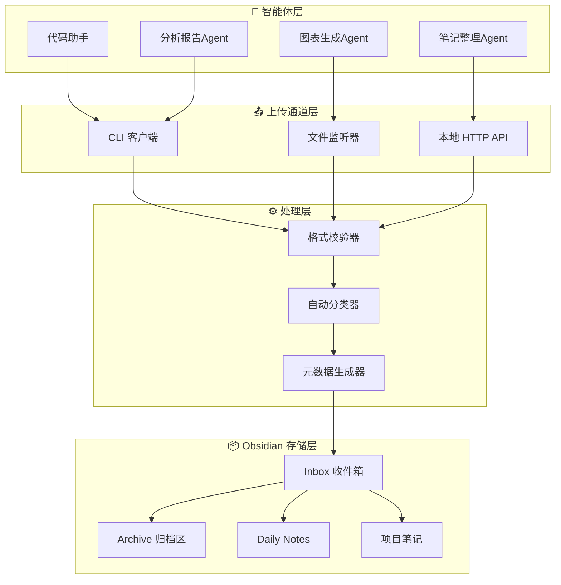
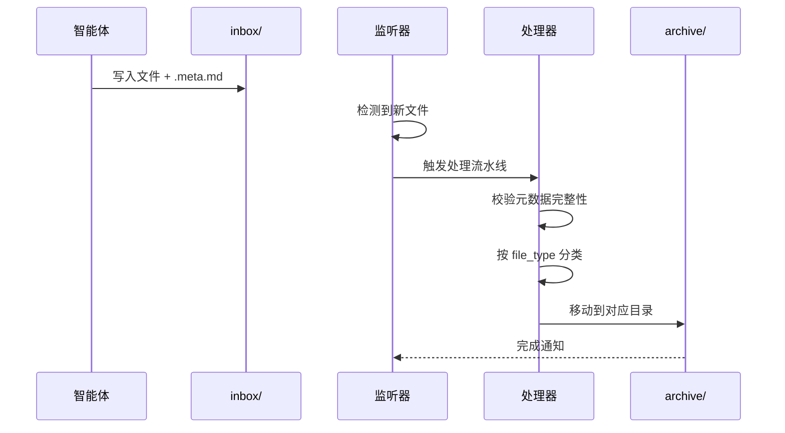
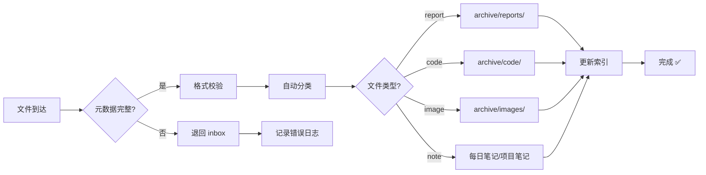

# 本地智能体产出通道设计

> [!abstract] 设计目标
> 构建一套标准化的本地智能体产出文件上传通道，使本地运行的 AI 智能体能够将生成的各类文件（报告、代码、图片、数据等）自动写入 Obsidian 知识库，并附带元数据以便检索和追溯。

## 系统架构



通过上图可以看到，整个通道分为 **智能体层**、**通道层**、**处理层** 和 **存储层** 四个层级。每个层级职责清晰，可独立扩展。

> [!tip] 设计原则
> 通道层应足够简单，让任何一个智能体只需一条命令即可完成上传。复杂逻辑（校验、分类、归档）交给处理层，不要在智能体端重复实现。

---

## 文件夹结构

```
📁 _agent-output/                  # 智能体产出根目录
├── 📁 inbox/                      # 接收区：智能体从这里写入
│   ├── 📄 2026-07-15_报告.md
│   ├── 📄 2026-07-15_代码片段.md
│   └── 📄 2026-07-15_图表.png
├── 📁 processing/                 # 处理中：待校验和分类
│   └── 📄 ...
├── 📁 archive/                    # 归档区：已处理完成的文件
│   ├── 📁 reports/
│   ├── 📁 code/
│   ├── 📁 images/
│   └── 📁 data/
├── 📁 schemas/                    # 元数据模板定义
│   ├── 📄 report-schema.yaml
│   └── 📄 code-schema.yaml
└── 📄 _index.md                   # 通道索引清单
```

> [!warning] 命名约定
> 统一使用 `YYYY-MM-DD_描述性名称.扩展名` 格式。智能体必须附加元数据文件（`.meta.md`），否则文件会被拒绝进入处理流水线。

---

## 元数据规范

每个上传文件必须附带同名的 `.meta.md` 元数据文件，描述产出的来源和属性。

### 元数据模板

```yaml
---
agent_name: "代码助手"               # 来源智能体名称
agent_type: "coding"                 # 智能体类型
created: 2026-07-15T14:30:00         # 产出时间
source_session: "session-abc123"     # 来源会话ID
file_type: "code"                    # 文件类型
tags:
  - python
  - refactoring
confidence: 0.92                     # 置信度（0-1）
task_id: "task-001"                  # 关联任务
description: "重构了用户认证模块的核心逻辑" # 产出描述
---
```

> [!todo] 必填字段
> - `agent_name` - 必须填写，否则无法溯源
> - `created` - 必须精确到秒
> - `file_type` - 必须为预定义类型之一：`report`、`code`、`image`、`data`、`note`、`config`
> - `description` - 简要描述产出内容

### 文件类型与路由规则

| 文件类型 | 路由目的地 | 示例 |
|---------|-----------|------|
| `report` | `_agent-output/archive/reports/` | 分析报告、周报 |
| `code` | `_agent-output/archive/code/` | 代码片段、脚本 |
| `image` | `_agent-output/archive/images/` | 图表、流程图 |
| `data` | `_agent-output/archive/data/` | CSV、JSON 数据 |
| `note` | `Daily Notes` 或 `_agent-output/inbox/` | 知识卡片 |
| `config` | `_agent-output/archive/config/` | 配置文件 |

---

## 上传方式

### 方式一：CLI 命令（推荐）

智能体通过命令行工具上传：

```bash
# 上传文件并附加元数据
agent-upload \
  --file ./output/analysis.md \
  --meta ./output/analysis.meta.md \
  --vault /path/to/obsidian-vault

# 简写模式（自动生成元数据）
agent-upload -f ./output/chart.png -t image -d "Q3 营收趋势图"
```

> [!tip] CLI 安装
> 将 `agent-upload` 脚本放入系统 PATH 中，所有智能体统一调用。支持 `--dry-run` 模式预览效果而不实际写入。

### 方式二：文件监听器（被动模式）

在 `_agent-output/inbox/` 目录上设置文件监听器，智能体只需将文件复制到该目录：

```bash
# 启动监听器（常驻后台）
agent-watch --vault /path/to/obsidian-vault
```



### 方式三：本地 HTTP API（高级）

适用于需要编程式集成的场景：

```bash
# 启动 API 服务
agent-server --port 8765 --vault /path/to/obsidian-vault

# 智能体通过 HTTP 上传
curl -X POST http://localhost:8765/upload \
  -F "file=@report.md" \
  -F "meta=@report.meta.md"
```

---

## 处理流水线

上传后的文件经过以下处理阶段：

> [!example] 处理流程
> 1. **格式校验** — 检查文件完整性、元数据必填字段
> 2. **自动分类** — 根据 `file_type` 字段路由到对应目录
> 3. **元数据嵌入** — 将 `.meta.md` 内容合并到目标文件的前置元数据中
> 4. **索引更新** — 刷新 `_index.md` 通道清单
> 5. **通知触达** — 可选：发送通知到 Obsidian 或系统通知中心



---

## 索引清单

`_index.md` 文件维护所有上传记录的清单，便于快速检索：

> [!abstract] _index.md 示例
> ```markdown
> ---
> title: 智能体产出通道索引
> updated: 2026-07-15
> ---
> 
> # 智能体产出索引
> 
> | 日期 | 智能体 | 类型 | 文件 | 状态 |
> |------|--------|------|------|------|
> | 2026-07-15 | 代码助手 | code | [[archive/code/2026-07-15_认证重构\|认证重构]] | ✅ |
> | 2026-07-15 | 分析Agent | report | [[archive/reports/2026-07-15_Q3趋势\|Q3趋势]] | ✅ |
> | 2026-07-14 | 笔记助手 | note | [[2026-07-14\|每日笔记]] | ✅ |
> ```

---

## 使用示例

### 完整工作流

1. 智能体生成产出文件 `analysis.md`
2. 智能体生成元数据文件 `analysis.meta.md`
3. 执行 `agent-upload -f analysis.md -m analysis.meta.md`
4. 处理器校验 → 分类 → 嵌入元数据 → 归档
5. 在 Obsidian 中通过 `[[_agent-output/archive/reports/analysis]]` 引用

> [!quote] 最佳实践
> - 智能体应在任务结束时自动调用上传命令
> - 使用 `agent-upload --dry-run` 预览分类结果
> - 在 `_agent-output/schemas/` 中维护元数据模板，供智能体动态填充
> - 定期清理 `inbox/` 和 `processing/` 中的残留文件

### 相关笔记

- [[_agent-output/schemas/report-schema]] — 报告类元数据模板
- [[_agent-output/schemas/code-schema]] — 代码类元数据模板
- [[_agent-output/_index]] — 产出索引清单
- [[agent-upload 命令参考]] — CLI 命令详细文档
- [[agent-watch 配置指南]] — 监听器配置说明

---

## 附录：快速实现方案（信任边界版 · 权威 MVP）

> [!success] 本附录为当前权威实现，与代码逐字对齐
> 上文「方式一 / 方式二 / 方式三」（`agent-upload` CLI、文件监听器、本地 HTTP API）是 v1.0 早期通用探索，**共同前提是「智能体能直接写入 vault 的 inbox」——该前提已废弃**。当前落地的是 **信任边界模型**：智能体永远碰不到 vault，只能写自己工作区的 `_outbox/`；能否进 vault 由用户本机的闸门脚本 `vault_bridge.py` 裁决。以下规格与 `agent-vault/_scripts/vault_bridge.py` 实现逐字对齐，为唯一权威 MVP。

### 信任边界模型

```
智能体（PEG-A / TRAE，各自沙箱）
   │  只写自己工作区，绝不碰 vault
   ▼
<agent 工作区>/_outbox/{name}.md + {name}.meta.md     ← 智能体唯一被允许的写入点
   │
   ▼
vault_bridge.py（用户本机闸门 · 纯文件系统 · 无需任何凭据）
   │  元数据校验 → §13 红线 → 安全闸门 → 分类归档
   ▼
agent-vault/_agent-output/ 与 _agent-sessions/         ← 落库（本机 git 工作树）
   │
   ▼
Obsidian（人工阅读） ∥ GitHub（SSH push 备份）          ← 末端消费者，并列、只读结果
```

关键：`git push` **不在 bridge 内**——bridge 只负责把文件搬进 vault 工作树，推送是用户本机独立的 SSH 动作。

### 三步跑通

1. 智能体在任务末尾把产出写进 **自己工作区** 的 `_outbox/`，成对写：
   - `{name}.md` — 产出正文
   - `{name}.meta.md` — 同名元数据（前置 YAML）
2. 用户本机执行 `python vault_bridge.py`（首次会自动创建 `_outbox/`）
3. Bridge 自动校验、过闸、分类归档进 vault；用户再自行 `git push`

### 元数据契约（`{name}.meta.md` 前置 YAML）

```yaml
---
agent_name: PEG-A              # 来源智能体（缺失 → 拒收）
created: 2026-07-21T14:30:00   # 产出时间（缺失 → 拒收）
file_type: report             # 枚举之一（见下）；非法值 → 拒收
description: 认证中间件重构总结   # 简述（缺失 → 拒收）
# --- 以下可选 ---
session_trace: true           # 标记为推理轨迹 → 强制路由 _agent-sessions/
tags:
  - python
  - refactoring
---
```

> [!todo] 必填四字段（缺一即拒收）
> `agent_name`、`created`、`file_type`、`description`。其中 `file_type` 必须为枚举之一：
> `report`、`code`、`image`、`data`、`note`、`config`。

### 路由规则（对齐脚本 `route_target`）

| 条件（自上而下优先匹配） | 目的地 |
|---|---|
| `session_trace: true` 或文件名含 `trace` | `_agent-sessions/` |
| `file_type: note` | `_agent-output/inbox/` |
| `file_type` ∈ {report, code, image, data, config} | `_agent-output/archive/<type>/` |
| 未知类型（兜底） | `_agent-output/inbox/` |

### 八段流水线（`vault_bridge.py` 实际执行）

1. **配对发现** — 扫描 `_outbox/*.md`（排除 `*.meta.md`），要求存在同名 `.meta.md`，否则跳过并告警
2. **元数据校验** — 四必填字段 + `file_type` 枚举；失败 → `_outbox/_rejected/<name>__<reason>/`
3. **§13 红线** — `phase0_meta_peg_agent_prompt[.full].md` 永不进 vault → `_outbox/_rejected/<name>__redline_phase0/`
4. **安全闸门** — 正文写入临时文件送 `explainability_check.py`（`exit≠0` 即 REJECT）→ `_outbox/_quarantine/<name>/`
5. **分类路由** — 见上表
6. **元数据嵌入** — `.md` 目标把 `.meta.md` 合并进前置 frontmatter（并追加 `bridged_at` / `source_outbox`），同时写同名 sidecar `.meta.md`；非 `.md` 文件仅复制原文件 + sidecar
7. **索引更新** — 向 `_agent-output/_index.md` 追加一行清单
8. **收尾归档** — 成功后将源对移入 `_outbox/_done/`（只移动、绝不删除原始产出）

### 命令行

```bash
python vault_bridge.py                       # 真实运行（默认本机路径）
python vault_bridge.py --dry-run -v          # 预览计划，不写任何文件 / 不移动
python vault_bridge.py --source <outbox> --vault <vault>   # 自定义路径
python vault_bridge.py --explainability ""   # 置空可跳过安全闸门（不建议）
```

默认路径：`--source` = `meta_peg_agent/_outbox`，`--vault` = `agent-vault`，`--explainability` = `meta_peg_agent/explainability_check.py`（亦可用环境变量 `MPA_OUTBOX` / `VAULT_ROOT` / `MPA_EXPLAIN` 覆盖）。

### `_outbox/` 内部结构（bridge 自动维护）

```
📁 _outbox/                     # 智能体唯一写入点（不进 git 跟踪）
├── 📄 {name}.md                # 智能体写入的产出正文（待处理）
├── 📄 {name}.meta.md           # 同名元数据
├── 📁 _done/                   # 成功归档后的源对
├── 📁 _rejected/               # 元数据不合格 / §13 红线
├── 📁 _quarantine/             # 安全闸门 REJECT
└── 📁 _tmp/                    # 闸门临时文件（自动清理）
```

> [!warning] 信任边界铁律
> - 智能体**只写** `_outbox/`，永远碰不到 vault 目录本身
> - 主文档 `phase0_meta_peg_agent_prompt[.full].md` 被 §13 红线**永久**挡在 vault 之外
> - Obsidian 看到的永远是「已过闸」的干净内容
> - bridge 不碰 git；推送由用户本机 SSH 完成

---

%% 以下为变更记录，阅读视图下不可见 %%

**变更记录**
- 2026-07-15：v1.0 初始版本，定义四层架构与三种上传方式
- 2026-07-21：v1.1 附录「快速实现方案」重写为**信任边界版权威 MVP**，与 `agent-vault/_scripts/vault_bridge.py` 逐字对齐（`_outbox` 唯一写入点 / 四必填字段 / file_type 枚举 / 路由表 / 八段流水线 / 命令行 / `_outbox` 内部结构 / §13 红线 / git push 不在 bridge 内）；声明上文方式一~三（智能体直写 inbox 模型）已废弃